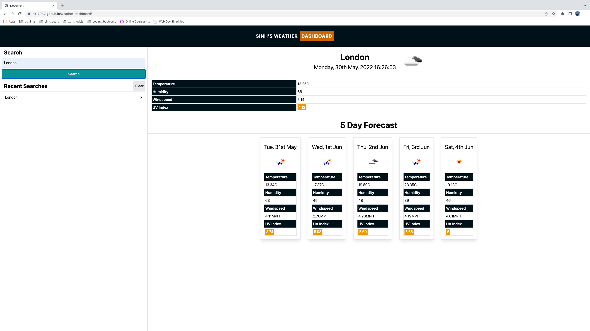
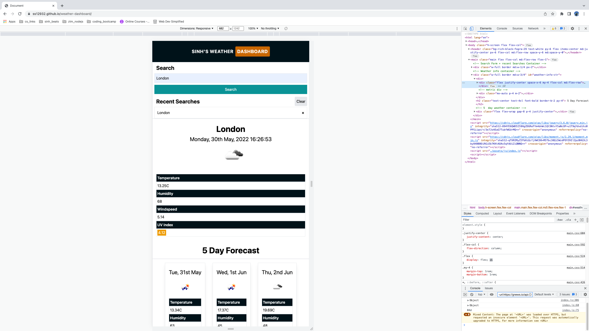

# weather-dashboard

## Overview

This Week's assignment is to build a weather dashboard that will run in the browser and feature dynamically with updated HTML and CSS. Using the Openweather one call API to retrieve weather data for cities and use local storage to store persistent data.

## Deployed Link

https://ss12932.github.io/weather-dashboard/

## Github Repository Link

https://github.com/ss12932/weather-dashboard

## Application Screenshot




## User Story

```
AS A traveler
I WANT to see the weather outlook for multiple cities
SO THAT I can plan a trip accordingly
```

## Technologies

HTML, TailwindCSS, JS, JQuery, Moment.js

## Package

None

## Dependencies

None

## License

[](https://opensource.org/licenses/MIT)

## Contact

Please Contact me on ss12932@my.bristol.ac.uk
